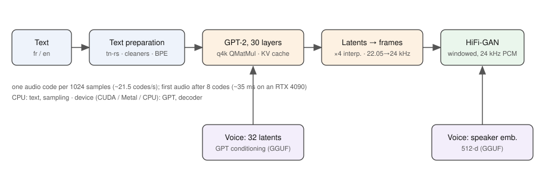

# Architecture

| Step | Module | Device |
|---|---|---|
| tn-rs normalization, XTTS cleaners, sentence split, final period dropped | `text.rs` | CPU |
| BPE (`vocab.json`, `[lang]` prefix, `[SPACE]` tokens) | `text.rs` (`TextTokenizer`) | CPU |
| Text and audio-code embeddings + learned position tables | `gpt.rs` | CPU → device |
| GPT-2, 30 layers × 1024, KV cache, over `[32 voice latents | text | codes]` | `gpt.rs`, `weights.rs` (`QMatMul`) | device |
| Sampling (repetition penalty, temperature, top-k, top-p) | `sampling.rs` | CPU |
| `final_norm` latents → ×4 linear interpolation → 22.05 → 24 kHz | `hifigan.rs` | device |
| HiFi-GAN conditioned on the 512-d speaker embedding, windowed for streaming | `hifigan.rs` (`StreamDecoder`) | device |

One audio code covers 1024 samples at 22.05 kHz (~21.5 codes/s). The GGUF
holds the config, tokenizer and voices as metadata; see `gguf.rs` for the
tensor layout and the conversions applied (weight norm folded, GPT-2
`Conv1D` transposed).
